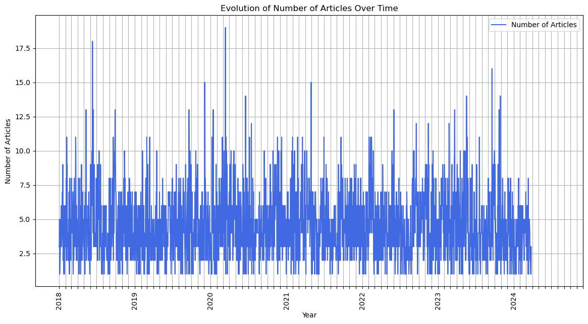
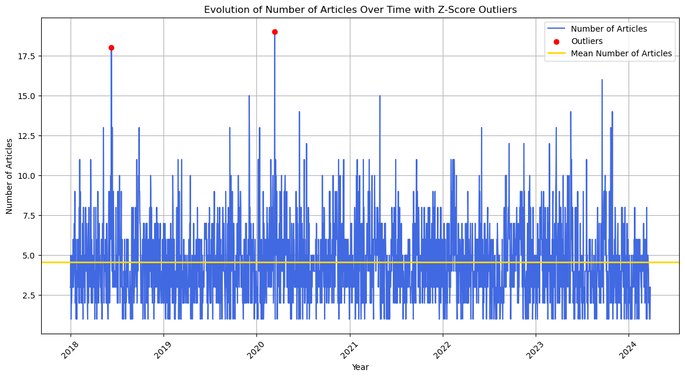

# Holiday Check Task
This repository is dedicated to the the tasks from Holiday Check application process.
> ## Task: 
> 
> Use the programming language of your choice.  
> Use the Guardian Media Group API.  
> 
> 1. **Extract information about Justin Trudeau.**  
> 2. **Count how many articles about Justin Trudeau have been posted since 01.01.2018 until today:**  
>    The output should consist of two columns:  
>    `Date` and `No. of articles`  
>    ```
>    2018-01-01 3  
>    2018-01-02 4  
>    2018-01-03 2  
>    ```
> 3. **Calculate the average of all days for the above-mentioned period from “No. of articles”.**  
> 4. **In which section are most articles written?**  
> 5. **Show the evolution of the "No. of articles" over time for the above period.**  
> 6. **Are there any unusual events in the time series under investigation?**  
> 7. **If so, show these. Why are these unusual?** (Define for yourself what you want to show by ordinary or unusual).  
> 8. **Based on question one. Show the cause of the unusual event.**  
> 
> Create a daily automated job that updates question 5 daily and creates an output that could be sent to recipients who have not seen the data before.


The deatiled solutions and codes for the tasks can be found in the following files in the repository:
1. TaskResults.ipynb - Contains solutions to questions 1-8
2. theGuardianJob.py - Contains the script for the daily automated job. This script can be run via a scheduler to run everyday. Scheduling infomation is given below.

For quick reference the solutions have been given below:

## Solutions
1. Articles about Justin Trudeau were fetched using The Guardian API.
2. Number of articles fetched (1.1.2018 until today(27.03.2024)) - 10171
3. There have been more than 4 articles posted about Justin Trudeau since 01.01.2018 per day on an average. Exact number =  4.579468707789284
4. Section 'World news' has most number of posts with 1070 articles
5. Evolution of Number of Articles overtime:

6. We can see some unusual spikes in the plot indicating the rise of number of articles.
7. These unusually high number of articles can be statistically measured by calculating z-score values. 

8. There were spikes in 2018 and 2020, due to news about Trudeau related to Trump and Covid19 respectively. In the notebook you can find the WordCloud illustrating this as well.


## Daily Automated Job - The Guardian Article Fetcher and Notifier

This Python script automates the fetching of articles from The Guardian's API, processing, visualizing the data, and emailing the results.

### Main Functions

#### `fetch_articles`

Fetches articles based on a search query and date range.

- **Parameters**:
  - `api_key`: API key for The Guardian.
  - `query`: Search query for articles.
  - `from_date`: Start date for the search.
  - `to_date`: End date for the search.
  - `page_size`: Articles per page (default 200).

- **Returns**: List of articles.

#### `process_new_articles`

Processes fetched articles, counting by day and section.

- **Parameter**:
  - `new_articles`: Articles from The Guardian's API.

- **Returns**: DataFrame with article data.

#### `update_data_and_plot`

Updates data with new articles and generates a plot.

- **Parameters**:
  - `api_key`: API key for The Guardian.
  - `query`: Search query.
  - `csv_file_path`: CSV file.
  - `root_path`: Directory path for files.

- **Returns**: Boolean indicating success.

#### `send_email`

Sends an email with an attached plot to recipients.

- **Parameters**:
  - `sender_email`: Email of the sender.
  - `sender_password`: Sender's email password.
  - `recipient_emails`: List of recipient emails.
  - `subject`: Email subject.
  - `body`: Email body text.
  - `attachment_path`: Path to the attachment.

### Main Script

Orchestrates the workflow from setup to emailing the plot.

1. **Setup**: Define the root path, API key, query, and file paths.
2. **Update and Plot**: Fetches new articles, updates the dataset, and generates a plot.
3. **Email Notification**: Sends an email with the plot if new data is added.

#### Note:
* Update API KEY.
* Update root path of csv and where to store the plot image.
* Update sender email and password.
* Update recipient emails.

### Execution

Ensure all dependencies are installed and you have a valid API key. Set the `api_key` and `sender_password`, then run the script or schedule it with cron for regular updates.

#### Scheduling the cronjob
To run the script every day at 7pm and hence send the emails as well use the following command.
Steps:
1. On Terminal type `crontab -e`.
2. Enter the following command.
`0 19 * * * /path/to/your_python /path/to/your_script/theGuardianJob.py`
3. Press `esc` and `:x` ro save and exit.

Contact: You can contact me for any clarifications at `nitinnandansingh@hotmail.com`